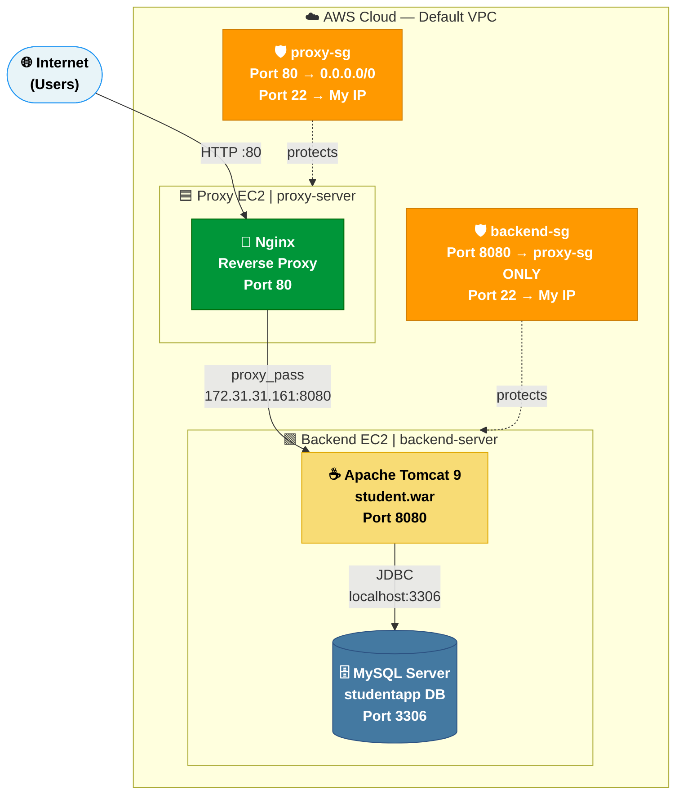
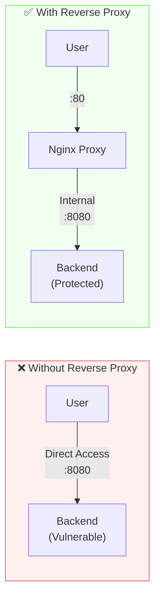
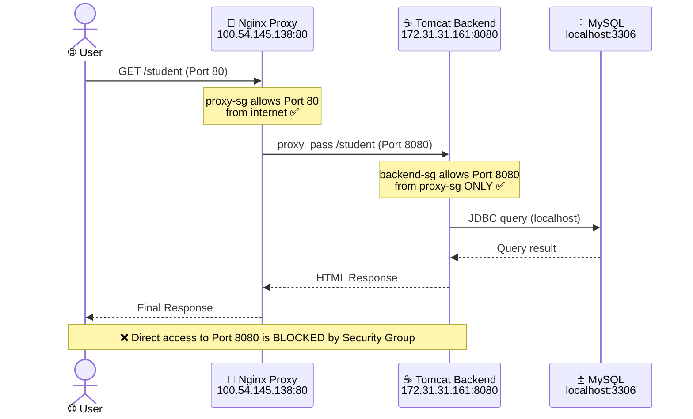
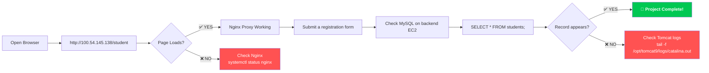
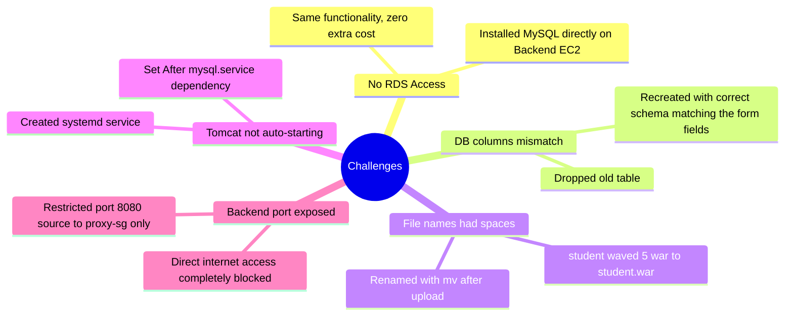

<div align="center">


<br/>

[](https://aws.amazon.com)
[](https://nginx.org)
[](https://tomcat.apache.org)
[](https://mysql.com)
[](https://openjdk.org)
[](https://ubuntu.com)

<br/>

> 🚀 **A production-grade secure deployment of a Java web application on AWS using Nginx as a reverse proxy — restricting direct backend exposure and routing all traffic through a dedicated proxy layer.**

<br/>

[](https://github.com)
[]()
[]()

</div>

---

## 📑 Table of Contents

- [🏗️ Architecture](#-architecture)
- [💡 Why This Architecture?](#-why-this-architecture)
- [🛠️ Tech Stack](#-tech-stack)
- [☁️ AWS Infrastructure](#-aws-infrastructure)
- [🔐 Security Design](#-security-design)
- [📋 Step-by-Step Setup](#-step-by-step-setup)
  - [Phase 1 — AWS Setup](#phase-1--aws-setup)
  - [Phase 2 — Backend EC2](#phase-2--backend-ec2-setup)
  - [Phase 3 — Proxy EC2](#phase-3--proxy-ec2-setup)
- [🗄️ Database Schema](#-database-schema)
- [⚙️ Nginx Configuration](#-nginx-configuration)
- [✅ Verification](#-verification)
- [🚧 Challenges & Solutions](#-challenges--solutions)
- [📁 Repository Structure](#-repository-structure)

---

## 🏗️ Architecture



---

## 💡 Why This Architecture?

> Exposing your application server directly to the internet is a major security risk. A **reverse proxy** sits in front of your backend, acting as a shield.



| Without Proxy | With Reverse Proxy |
|---|---|
| ❌ Backend port exposed publicly | ✅ Backend hidden behind proxy |
| ❌ App server handles all traffic | ✅ Nginx handles routing & load |
| ❌ No traffic control layer | ✅ Centralized access control |
| ❌ SSL termination is complex | ✅ SSL can be handled at proxy |

---

## 🛠️ Tech Stack

<div align="center">

| Layer | Technology | Version | Role |
|:---:|:---:|:---:|:---|
| ☁️ Cloud | Amazon EC2 | Ubuntu 22.04 | Virtual machines (2 instances) |
| 🔀 Proxy | Nginx | Latest | Reverse proxy on Port 80 |
| ☕ Runtime | Apache Tomcat | 9.0.82 | Java servlet container on Port 8080 |
| 🔧 Language | Java (OpenJDK) | 11 | Application runtime |
| 🗄️ Database | MySQL Server | 8.0.45 | Student registration data storage |
| 🔌 Connector | MySQL Connector/J | 8.0.33 | JDBC driver for Java ↔ MySQL |
| 🛡️ Security | AWS Security Groups | - | Network-level firewall |

</div>

---

## ☁️ AWS Infrastructure

### EC2 Instances

```
┌─────────────────────────────────────────────────────────┐
│                   AWS Default VPC                        │
│                                                          │
│   ┌──────────────────────┐  ┌──────────────────────┐   │
│   │    proxy-server       │  │   backend-server      │   │
│   │  ──────────────────  │  │  ──────────────────  │   │
│   │  AMI: Ubuntu 22.04   │  │  AMI: Ubuntu 22.04   │   │
│   │  Type: t2.micro      │  │  Type: t2.micro      │   │
│   │  Public IP: Enabled  │  │  Public IP: Enabled  │   │
│   │  SG: proxy-sg        │  │  SG: backend-sg      │   │
│   └──────────────────────┘  └──────────────────────┘   │
└─────────────────────────────────────────────────────────┘
```

### Security Groups

**`proxy-sg`** — Proxy Server Rules:

| Type | Protocol | Port | Source | Purpose |
|---|---|---|---|---|
| HTTP | TCP | 80 | `0.0.0.0/0` | Accept public web traffic |
| SSH | TCP | 22 | `My IP` | Admin access |

**`backend-sg`** — Backend Server Rules:

| Type | Protocol | Port | Source | Purpose |
|---|---|---|---|---|
| Custom TCP | TCP | 8080 | `proxy-sg` | **Only the proxy can reach Tomcat** |
| SSH | TCP | 22 | `My IP` | Admin access |

> 🔑 **The key security rule:** Port 8080 source is set to `proxy-sg` — not `0.0.0.0/0`. This means **only the proxy EC2** can talk to the backend. Direct internet access is completely blocked.

---

## 🔐 Security Design



---

## 📋 Step-by-Step Setup

### Phase 1 — AWS Setup

#### 1️⃣ Launch Backend EC2
```
AWS Console → EC2 → Launch Instance
├── Name: backend-server
├── AMI: Ubuntu Server 22.04 LTS
├── Instance Type: t2.micro
├── Key Pair: Project-1.pem (create & download)
├── Auto-assign Public IP: Enable
└── Security Group: Create backend-sg
    ├── SSH (22) → My IP
    └── Custom TCP (8080) → proxy-sg  ← update after proxy is created
```

#### 2️⃣ Launch Proxy EC2
```
AWS Console → EC2 → Launch Instance
├── Name: proxy-server
├── AMI: Ubuntu Server 22.04 LTS
├── Instance Type: t2.micro
├── Key Pair: Project-1.pem (same key)
├── Auto-assign Public IP: Enable
└── Security Group: Create proxy-sg
    ├── SSH  (22) → My IP
    └── HTTP (80) → 0.0.0.0/0
```

---

### Phase 2 — Backend EC2 Setup

#### 3️⃣ Upload Files to Backend EC2
```bash
# Run from your local machine (Windows PowerShell / Linux terminal)
scp -i "Project-1.pem" student.war       ubuntu@<BACKEND_PUBLIC_IP>:~/student.war
scp -i "Project-1.pem" mysql-connector.jar ubuntu@<BACKEND_PUBLIC_IP>:~/mysql-connector.jar
```

#### 4️⃣ SSH into Backend & Install Java
```bash
ssh -i "Project-1.pem" ubuntu@<BACKEND_PUBLIC_IP>

# Update system
sudo apt-get update -y && sudo apt-get upgrade -y

# Install Java 11
sudo apt-get install -y openjdk-11-jdk
java -version
```

#### 5️⃣ Install & Configure MySQL
```bash
# Install MySQL Server
sudo apt-get install -y mysql-server
sudo systemctl start mysql
sudo systemctl enable mysql

# Create database, user and table
sudo mysql -u root << 'EOF'
CREATE DATABASE IF NOT EXISTS studentapp;
CREATE USER IF NOT EXISTS 'studentuser'@'localhost' IDENTIFIED BY 'Student@1234';
GRANT ALL PRIVILEGES ON studentapp.* TO 'studentuser'@'localhost';
FLUSH PRIVILEGES;
USE studentapp;

CREATE TABLE students (
    id            INT AUTO_INCREMENT PRIMARY KEY,
    name          VARCHAR(100) NOT NULL,
    address       VARCHAR(200),
    age           INT,
    qualification VARCHAR(100),
    percentage    DECIMAL(5,2),
    year          INT,
    created_at    TIMESTAMP DEFAULT CURRENT_TIMESTAMP
);
EOF
```

#### 6️⃣ Install Apache Tomcat 9
```bash
cd /opt

# Download Tomcat
sudo wget https://archive.apache.org/dist/tomcat/tomcat-9/v9.0.82/bin/apache-tomcat-9.0.82.tar.gz

# Extract and rename
sudo tar -xzf apache-tomcat-9.0.82.tar.gz
sudo mv apache-tomcat-9.0.82 tomcat9
sudo chmod -R 755 /opt/tomcat9
sudo chmod +x /opt/tomcat9/bin/*.sh
```

#### 7️⃣ Deploy Application
```bash
# Place MySQL Connector in Tomcat lib
sudo cp ~/mysql-connector.jar /opt/tomcat9/lib/

# Deploy the WAR file
sudo cp ~/student.war /opt/tomcat9/webapps/student.war

# Create systemd service so Tomcat auto-starts
sudo tee /etc/systemd/system/tomcat.service > /dev/null << 'EOF'
[Unit]
Description=Apache Tomcat 9
After=network.target mysql.service

[Service]
Type=forking
User=root
Environment="JAVA_HOME=/usr/lib/jvm/java-11-openjdk-amd64"
Environment="CATALINA_HOME=/opt/tomcat9"
ExecStart=/opt/tomcat9/bin/startup.sh
ExecStop=/opt/tomcat9/bin/shutdown.sh
Restart=on-failure

[Install]
WantedBy=multi-user.target
EOF

sudo systemctl daemon-reload
sudo systemctl enable tomcat
sudo systemctl start tomcat

# Verify — should return HTML
curl http://localhost:8080/student
```

---

### Phase 3 — Proxy EC2 Setup

#### 8️⃣ SSH into Proxy EC2 & Install Nginx
```bash
ssh -i "Project-1.pem" ubuntu@<PROXY_PUBLIC_IP>

sudo apt-get update -y
sudo apt-get install -y nginx
```

#### 9️⃣ Configure Reverse Proxy
```bash
# Remove default config
sudo rm -f /etc/nginx/sites-enabled/default

# Create reverse proxy config
sudo tee /etc/nginx/sites-available/student-app > /dev/null << 'EOF'
server {
    listen 80;
    server_name _;

    location /student {
        proxy_pass         http://<BACKEND_PRIVATE_IP>:8080/student;
        proxy_set_header   Host              $host;
        proxy_set_header   X-Real-IP         $remote_addr;
        proxy_set_header   X-Forwarded-For   $proxy_add_x_forwarded_for;
        proxy_set_header   X-Forwarded-Proto $scheme;
        proxy_connect_timeout 60s;
        proxy_read_timeout    60s;
    }

    location / {
        return 301 /student;
    }
}
EOF

# Enable & restart
sudo ln -sf /etc/nginx/sites-available/student-app /etc/nginx/sites-enabled/
sudo nginx -t
sudo systemctl restart nginx
sudo systemctl enable nginx
```

#### 🔟 Test Everything
```bash
# From proxy EC2
curl http://localhost/student

# From browser
http://<PROXY_PUBLIC_IP>/student
```

---

## 🗄️ Database Schema

```sql
CREATE DATABASE IF NOT EXISTS studentapp;
USE studentapp;

CREATE TABLE students (
    id            INT AUTO_INCREMENT PRIMARY KEY,  -- Auto-generated unique ID
    name          VARCHAR(100) NOT NULL,           -- Student full name
    address       VARCHAR(200),                    -- Student address
    age           INT,                             -- Student age
    qualification VARCHAR(100),                   -- Highest qualification
    percentage    DECIMAL(5,2),                   -- Marks percentage
    year          INT,                             -- Year of passing
    created_at    TIMESTAMP DEFAULT CURRENT_TIMESTAMP  -- Registration timestamp
);
```

**Sample data stored:**

| id | name | address | age | qualification | % | year |
|---|---|---|---|---|---|---|
| 1 | Arkan Tandel | Ghorpadi Gaon | 20 | Graduate | 68.00 | 2025 |
| 2 | Rahul Sharma | Pune, Maharashtra | 21 | Graduate | 72.50 | 2024 |
| 3 | Priya Patel | Mumbai, Maharashtra | 22 | Post Graduate | 85.00 | 2023 |
| ... | ... | ... | ... | ... | ... | ... |

---

## ⚙️ Nginx Configuration

> **File location:** `/etc/nginx/sites-available/student-app`

```nginx
server {
    listen 80;
    server_name _;

    # ── Forward /student requests to Tomcat backend ──────────
    location /student {
        proxy_pass         http://172.31.31.161:8080/student;

        # Pass real client info to backend
        proxy_set_header   Host              $host;
        proxy_set_header   X-Real-IP         $remote_addr;
        proxy_set_header   X-Forwarded-For   $proxy_add_x_forwarded_for;
        proxy_set_header   X-Forwarded-Proto $scheme;

        # Timeout settings
        proxy_connect_timeout 60s;
        proxy_read_timeout    60s;
        proxy_send_timeout    60s;
    }

    # ── Redirect root to /student ─────────────────────────────
    location / {
        return 301 /student;
    }
}
```

**What each directive does:**

| Directive | Purpose |
|---|---|
| `proxy_pass` | Forwards request to the backend Tomcat server |
| `proxy_set_header Host` | Passes the original host header to backend |
| `proxy_set_header X-Real-IP` | Sends the real client IP (not proxy IP) to backend |
| `proxy_set_header X-Forwarded-For` | Chain of IPs the request has passed through |
| `proxy_connect_timeout` | How long Nginx waits to connect to backend |
| `return 301 /student` | Redirects root URL to app path |

---

## ✅ Verification



**Useful debug commands:**
```bash
# Check Tomcat status and logs
sudo systemctl status tomcat
sudo tail -f /opt/tomcat9/logs/catalina.out

# Check Nginx status and logs
sudo systemctl status nginx
sudo tail -f /var/log/nginx/error.log
sudo tail -f /var/log/nginx/access.log

# Verify database records
sudo mysql -u root -e "USE studentapp; SELECT * FROM students;"

# Test proxy is forwarding correctly
curl -v http://<PROXY_PUBLIC_IP>/student
```

---

## 🚧 Challenges & Solutions



---

## 📁 Repository Structure

```
📦 project1-java-reverse-proxy-aws
 ┣ 📂 scripts
 ┃ ┣ 📜 setup_backend.sh       ← Full backend setup automation script
 ┃ ┣ 📜 setup_proxy.sh         ← Nginx proxy setup automation script
 ┃ ┗ 📜 rds_setup.sql          ← Database schema creation SQL
 ┣ 📂 config
 ┃ ┗ 📜 nginx-student-app.conf ← Nginx reverse proxy configuration
 ┣ 📜 README.md                ← This file
 ┗ 📜 report.md                ← Detailed project report
```

---

<div align="center">

## 🌐 Live Deployment

| Component | URL / Detail |
|:---:|:---:|
| 🔀 **Application (via Proxy)** | `http://100.54.145.138/student` |
| ☕ **Backend Direct** | `http://23.22.253.123:8080/student` |
| 🗄️ **Database** | MySQL on `localhost:3306` → `studentapp` |

<br/>

---


**Built with 💙 by Arkan Tandel — FortuneCloud Internship 2026**

[](https://github.com)

</div>
